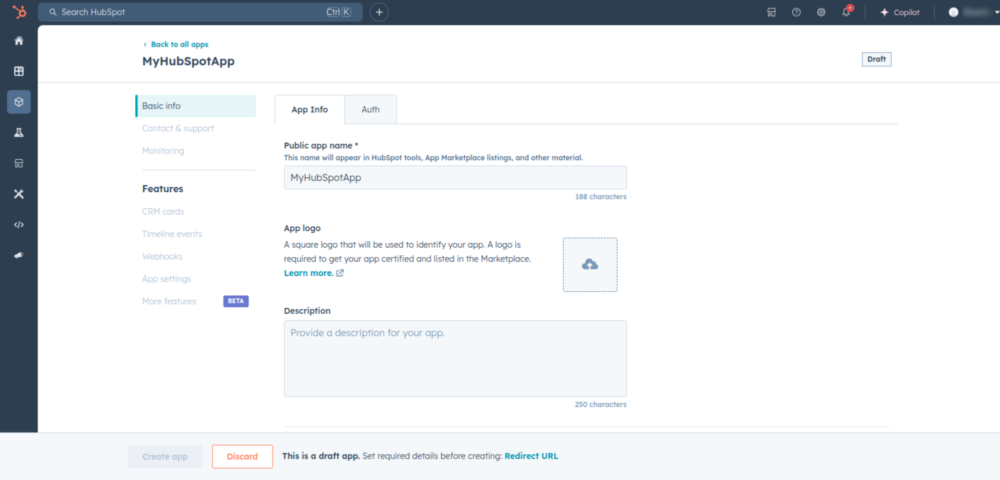
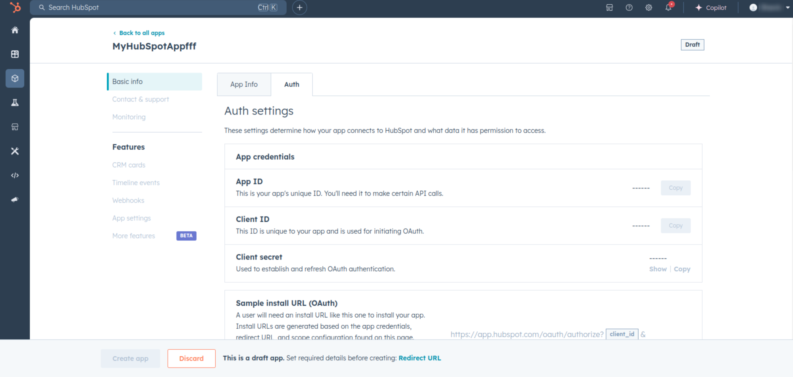
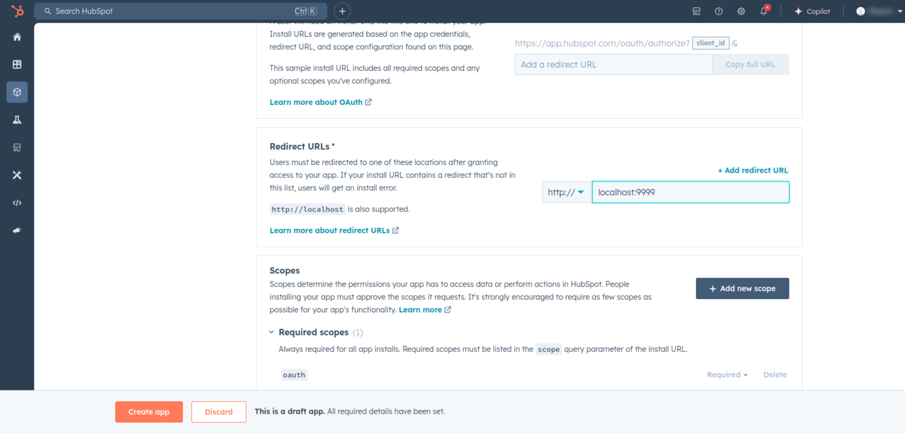
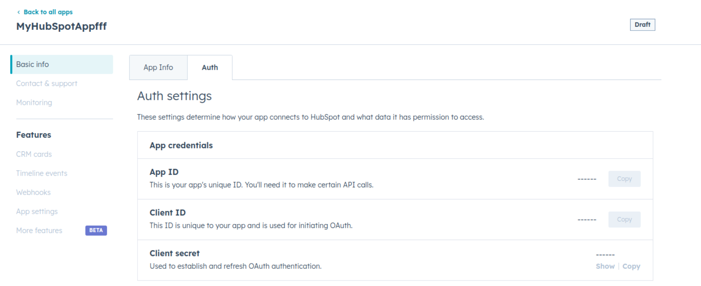

## Overview

[//]: # (TODO: Add overview mentioning the purpose of the module, supported REST API versions, and other high-level details.)

[HubSpot](https://www.hubspot.com/?hubs_content=www.hubspot.com/our-story&hubs_content-cta=null) is an inbound marketing, sales, and customer service platform offering tools for CRM, content management, email marketing, lead generation, and analytics to help businesses grow and engage customers effectively.

## Setup guide

[//]: # (TODO: Add detailed steps to obtain credentials and configure the module.)

To use the HubSpot connector, you must have access to the HubSpot API through a [HubSpot developer account](https://developers.hubspot.com/get-started) and a project under it. If you do not have a HubSpot Developer account, you can sign up for one [here](https://app.hubspot.com/signup-hubspot/developers?_ga=2.207749649.2047916093.1734412948-232493525.1734412948&step=landing_page).

### Step 1: Create a HubSpot Developer Project

1. Open the [HubSpot Developer Portal](https://app.hubspot.com/login/?loginRedirectUrl=https%3A%2F%2Fapp.hubspot.com%2Fsignup-hubspot%2Fdevelopers%3F_ga%3D2.269102326.624948025.1734413225-1764281074.1734413225%26step%3Dlanding_page)

2. Click on the 'App' tab and select an existing project or create a new project for which you want API keys and Authentication Access. 


In order to create a new poject, you must provide a public app name and a redirect url/s. Optionally you can add a app logo and a description for the app.



To add redirect url/s for the app, click the 'Auth' tab on top of the page, and navigate to 'Redirect URLs' section.





### Setp 2. Obtain Client ID and Client Secret.

1. After completing the project setup, you will be provided with your client id and client secret.  Make sure to save the provided client id and client secret.



### 2. Setup OAuth 2.0 Flow

Before proceeding with Quick start, ensure you ave obtained the Access Token and refresh Token using the following steps:

1. Add necessaryscopes for your app based on API your using. Go to the relevate [API reference](https://developers.hubspot.com/beta-docs/reference/api),  select the API  you have  and go through the operation.

You will see the scope has defined below way


2. Obtained the authorization URL (Install URL) from the Auth Section under 'Sample install URL (OAuth)' section.  It will be in this format:

```
https://app.hubspot.com/oauth/authorize?client_id=<client_id>&redirect_uri=<redirect_url>&scope=<scopes>
```
3. Copy and paste the generated URL into your browser. This will redirect you to the HubSpot authorization page.


4. Once you authorize, you will be redirected to your specified redirect URI with an authorization code in the URL.

**Note**: Store the authorization code and use it promptly as it expires quickly.

5. Use the obtained authorization code to run the following curl command, replacing <your_client_id>, <your_redirect_url>, and <your_authorization_code> with your specific values:

 - Linux/MacOS:
```bash
curl --request POST \
  --url https://api.hubapi.com/oauth/v1/token \
  --header 'content-type: application/x-www-form-urlencoded' \
  --data 'grant_type=authorization_code&code=<your_authorization_code>&redirect_uri=<your_redirect_url>&client_id=<your_client_id>&client_secret=<your_client_secret>'
```

 - Windows:
 ```bash
 curl --request POST \
  --url https://api.hubapi.com/oauth/v1/token ^
  --header 'content-type: application/x-www-form-urlencoded' ^
  --data 'grant_type=authorization_code&code=<your_authorization_code>&redirect_uri=<your_redirect_url>&client_id=<your_client_id>&client_secret=<your_client_secret>'
 ```

 This command will return the access token and refresh token necessary for API calls.

 ```json
{
  "token_type": "bearer",
  "refresh_token": "xxxxxxxxxxxxxxxxxxxxxxxxxxxxxxx",
  "access_token": "xxxxxxxxxxxxxxxxxxxxxxxxxxxxxxxxxxxxxxxxxxx",
  "expires_in": 1800
}
 ```

 6. Store the access token securely for use in your application.


## Quickstart

[//]: # (TODO: Add a quickstart guide to demonstrate a basic functionality of the module, including sample code snippets.)

## Examples

The `Ballerina HubSpot CRM Contacts Connector` connector provides practical examples illustrating usage in various scenarios. Explore these [examples](https://github.com/module-ballerinax-hubspot.crm.object.contacts/tree/main/examples/), covering the following use cases:

[//]: # (TODO: Add examples)
